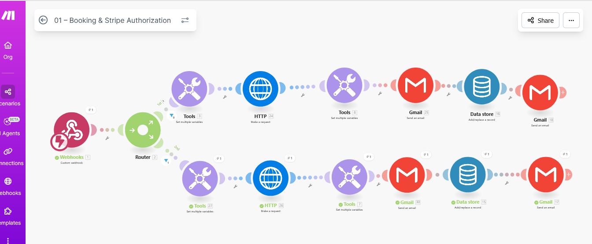
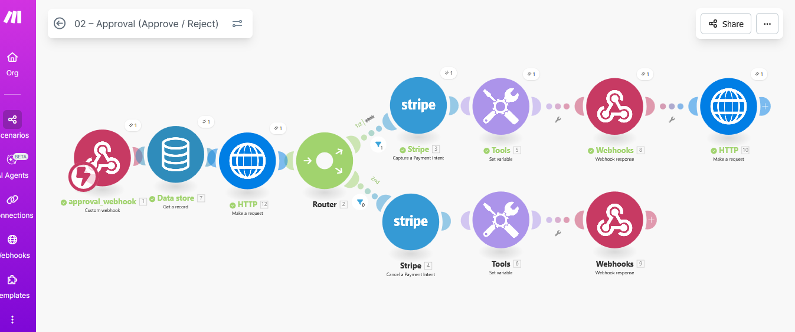
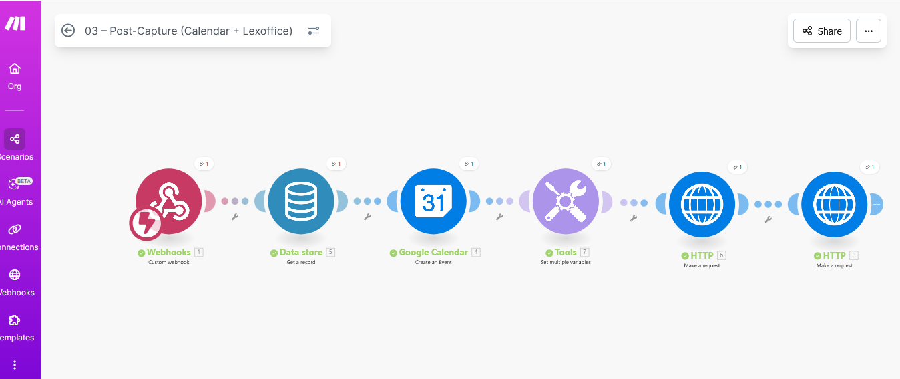
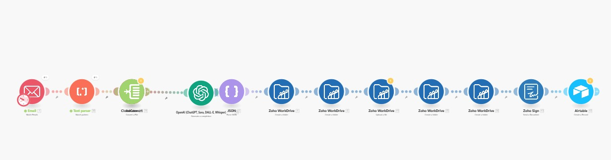
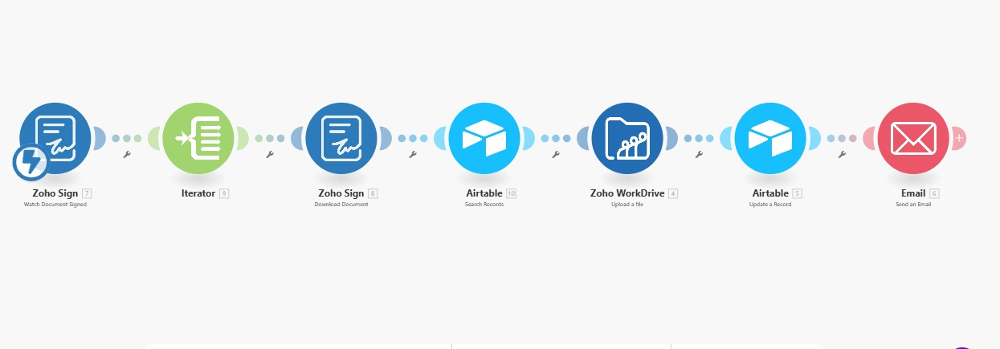
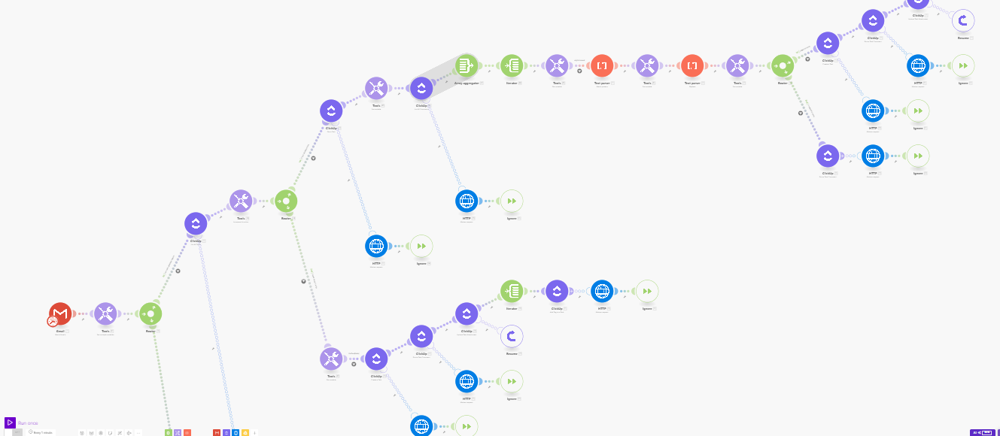

#  Tripetto → ClickUp Task Creation | Brevo PDF | Outlook Meeting Automation

## Purpose
This automation streamlines lead handling by automatically creating tasks, sending documentation, and scheduling follow-ups after a Tripetto form submission.

The workflow ensures structured processing, duplication prevention, and immediate engagement with new leads.

---

## Use Case
This system is ideal for businesses that:

- Collect leads via Tripetto forms  
- Need automatic task creation in ClickUp  
- Send onboarding PDFs automatically  
- Schedule structured follow-up meetings  
- Prevent duplicate client entries  

---

## Key Features

- Instant trigger on Tripetto submission  
- Duplicate task check by Client Name  
- Automatic ClickUp task creation  
- PDF email sent via Brevo  
- Outlook meeting scheduled (+24 hours)  
- Structured automation logic  

---

## Architecture Overview

### Scenario – Lead Processing

1. Tripetto form submission triggers automation  
2. Check duplication in ClickUp  
3. Create task if not already exists  
4. Send PDF email via Brevo  
5. Schedule Outlook meeting after 24 hours  

---

## Automation Flow Diagram

---

## Tech Stack

- Make.com  
- Tripetto  
- ClickUp API  
- Brevo  
- Microsoft Outlook  
- Make Data Store  

---

#  AI-Powered SEO → WordPress Article Automation

## Purpose

This automation generates fully SEO-optimized articles and publishes them automatically as draft posts in WordPress.

It combines keyword research, AI content generation, image creation, and WordPress publishing.

---

## Use Case

Designed for:

- SEO agencies  
- Content marketing teams  
- Website owners needing automated blog posts  
- Niche blog scaling  

---

## Key Features

- Keyword research via DataForSEO  
- AI-generated SEO content  
- Featured image generation  
- Image upload to WordPress Media  
- Draft post publishing  
- Runs daily (2 articles per day)  

---

## Architecture Overview

### Scenario – Daily Content Automation

1. Fetch keyword topic  
2. Generate SEO-optimized article  
3. Generate featured image  
4. Upload image to WordPress  
5. Publish article as Draft  

---

## Automation Flow Diagram

---

## Tech Stack

- Make.com  
- DataForSEO  
- WordPress REST API  
- AI Content Engine  
- Image Generation API  

---

#  ClickUp Delivered → Review Request Email Automation

## Purpose

This automation automatically sends review request emails two months after a task is marked as completed in ClickUp.

The system tracks finished dates and prevents duplicate emails using Make Data Store.

---

## Use Case

Ideal for:

- Agencies  
- Freelancers  
- Service-based businesses  
- Reputation management workflows  

---

## Key Features

- Daily monitoring of finished ClickUp tasks  
- Finished date tracking in Data Store  
- 2-month waiting condition  
- Duplicate prevention system  
- Automated review request via Brevo  

---

## Architecture Overview

### Scenario – Review Automation

1. Check completed tasks daily  
2. Store finished date in Data Store  
3. Verify if 2 months have passed  
4. Check if email already sent  
5. Send review email via Brevo  
6. Mark Email Sent = Yes  

---

## Automation Flow Diagram

---

## Tech Stack

- Make.com  
- ClickUp API  
- Brevo  
- Make Data Store  

---

#  Facebook Monitoring → Email Alerts Automation

## Purpose

This automation monitors managed Facebook pages and sends email alerts when specific keywords are detected in daily posts.

---

## Use Case

Designed for:

- Brand monitoring  
- Competitor tracking  
- Lead detection  
- Keyword-based alerts  

---

## Key Features

- Daily Facebook page monitoring  
- Same-day post filtering  
- Keyword detection logic  
- Email alerts via Brevo  
- Automated scheduled execution  

---

## Architecture Overview

### Scenario – Facebook Monitoring

1. Retrieve managed Facebook pages  
2. Fetch same-day posts  
3. Check content against predefined keywords  
4. Send email alert with post link  

---

## Automation Flow Diagram

---

## Tech Stack

- Make.com  
- Facebook Graph API  
- Brevo  

# Stripe Manual Approval Booking System (Make.com Automation)

## Purpose

This project implements an automated booking and payment system where Stripe payments are **authorized first and captured only after manual approval**.

The entire solution is built using **Make.com**, leveraging **Stripe PaymentIntents with manual capture**, email-based approval workflows, and persistent data storage to ensure secure and controlled payment handling.

---

## Use Case

This system is designed for businesses that:

- Sell time-based services (e.g. advertising slots, promotions, campaigns)
- Require **manual review and approval** before charging customers
- Want to avoid accidental or unauthorized payments
- Need a clear audit trail for bookings and approvals

Typical use cases include:
- Advertising bookings (1-day / 3-day campaigns)
- Media placements
- Influencer or promotional campaigns
- High-value service reservations

---

## Key Features

- Stripe PaymentIntent with **manual capture**
- Email-based approval flow (Approve / Reject)
- Secure booking identification using UUIDs
- Persistent storage with Make Data Store
- Modular and scalable scenario architecture
- 100% Stripe test mode (safe for development)
- Extendable for calendar blocking and invoicing

---

## Architecture Overview

The automation is structured into three independent Make.com scenarios:

1. **Scenario 01 – Booking & Stripe Authorization**
   - Receives booking requests via webhook
   - Creates a Stripe PaymentIntent (authorization only)
   - Stores booking data in Make Data Store
   - Sends approval email to the administrator

2. **Scenario 02 – Manual Approval (Approve / Reject)**
   - Receives approval decision via webhook
   - Captures or cancels the Stripe PaymentIntent
   - Updates booking status accordingly

3. **Scenario 03 – Post-Capture Processing (Extendable)**
   - Calendar availability blocking
   - Invoice creation (e.g. Lexoffice)
   - Customer confirmation emails

---

## Approval Flow

1. Customer submits a booking request
2. Stripe PaymentIntent is created with manual capture
3. Administrator receives an approval email
4. Administrator approves or rejects the booking
5. Stripe payment is captured or canceled
6. Booking status is updated and stored

---

## Automation Flow Diagram

---

## Test Mode Notice

This project is configured to run **entirely in Stripe test mode**.

- No live Stripe keys
- No real payments
- Safe for development, testing, and demonstration purposes

---

## Tech Stack

- Make.com
- Stripe API (PaymentIntents – Manual Capture)
- Gmail / SMTP for email approvals
- Make Data Store

---

## License

This project is provided as a reference implementation and portfolio example.

# Zoho Sign Contract Automation System (Make.com)

## Purpose
This project implements an end-to-end **contract generation, electronic signing, and vendor delivery automation** using **Make.com**, **Zoho Writer**, **Zoho Sign**, **CloudConvert**, and **Airtable**.

The automation streamlines the complete agreement lifecycle — from extracting contract details via email, generating documents, converting file formats, collecting electronic signatures, and delivering finalized contracts back to vendors with full traceability.

---

## Use Case
This solution is designed for organizations that:

- Send agreements or contracts to vendors, attorneys, or partners
- Receive contract information through email
- Require legally signed documents before execution
- Want a fully automated and auditable contract workflow
- Need centralized tracking of contract status and history

### Typical Use Cases
- Attorney engagement agreements
- Vendor contracts
- Service agreements
- NDA and compliance documents
- Client onboarding contracts

---

## Key Features
- Automated email data extraction for contract details
- JSON-based document merge using Zoho Writer
- Dynamic agreement document generation
- File format conversion via CloudConvert
- Electronic signature collection using Zoho Sign
- Automatic vendor notification and signed document delivery
- Centralized contract record management with Airtable
- Modular and scalable Make.com scenario architecture

---

## Architecture Overview
The automation is structured into **two independent Make.com scenarios**, ensuring reliability, scalability, and easy maintenance.

---

## Scenario 01 – Email Intake & Data Storage
- Monitors incoming emails containing contract-related information
- Extracts structured data from email content
- Parses and normalizes data into a standardized JSON format
- Stores contract records in Airtable
- Prepares structured data for document generation

---

## Scenario 02 – Document Signing & Vendor Delivery
- Generates agreement documents using Zoho Writer merge templates
- Converts documents into required formats using CloudConvert
- Sends documents to Zoho Sign for electronic signing
- Automatically places signature and date fields
- Collects digitally signed contracts
- Sends finalized signed documents back to the vendor

---

## Signing & Delivery Flow
1. Contract details are received via email
2. Data is extracted and stored in Airtable
3. Agreement document is generated automatically
4. Document is converted to the required format
5. Contract is sent for electronic signature
6. Vendor signs the document digitally
7. Final signed contract is delivered to the vendor
8. Contract status and records are stored for auditing

---

## Automation Flow Diagram

---

## Tech Stack
- **Make.com**
- **Zoho Writer** (Document Merge Templates)
- **Zoho Sign** (Electronic Signatures)
- **CloudConvert** (File Conversion)
- **Airtable** (Contract Data Storage)
- **Email** (Gmail / SMTP / IMAP)

---

## License
This project is provided as a **reference implementation and portfolio showcase**.  
It demonstrates practical, real-world automation design using **Make.com** and the **Zoho ecosystem**.

# Gmail Integration with ClickUp (Make.com)

## Purpose
This project automates order-related task creation by integrating **Gmail** with **ClickUp** using **Make.com**.  
The automation monitors incoming emails, categorizes them based on subject lines, and creates corresponding tasks in ClickUp, including automatic attachment handling.

---

## Use Case
This solution is designed for teams that:

- Receive orders or requests via email
- Manage work using ClickUp
- Want to eliminate manual task creation
- Need automatic attachment handling
- Require better organization and faster response times

### Typical Use Cases
- Order processing and fulfillment
- Customer service requests
- Support ticket creation
- Internal task assignment from emails

---

## Key Features
- Gmail trigger for new incoming emails
- Email subject-based categorization
- Automatic ClickUp task creation
- Attachment detection and upload to ClickUp
- Organized task naming and structuring
- Scalable Make.com automation design

---

## Automation Workflow
1. A new email is received in Gmail  
2. The subject line is analyzed and categorized  
3. A corresponding task is created in ClickUp  
4. Email attachments are detected  
5. Attachments are uploaded to the ClickUp task  
6. Tasks are organized for efficient processing  

---

## Architecture Overview
The automation is implemented as a **single Make.com scenario** for simplicity and maintainability.

### Scenario – Gmail to ClickUp Task Automation
- Monitors Gmail inbox for new messages  
- Applies subject-based filtering and categorization  
- Creates tasks in ClickUp with relevant details  
- Attaches files directly to the created task  

---
## Automation Flow Diagram

## Tech Stack
- **Make.com**
- **Gmail**
- **ClickUp**

---

## Skills & Deliverables
- Workflow automation using Make.com  
- Gmail API integration  
- ClickUp task management automation  
- Conditional logic and email parsing  
- Attachment handling and file automation  
- Process optimization and workflow efficiency  

---

## License
This project is provided as a **portfolio and reference implementation**.  
It demonstrates practical automation skills using Make.com and productivity tools.

